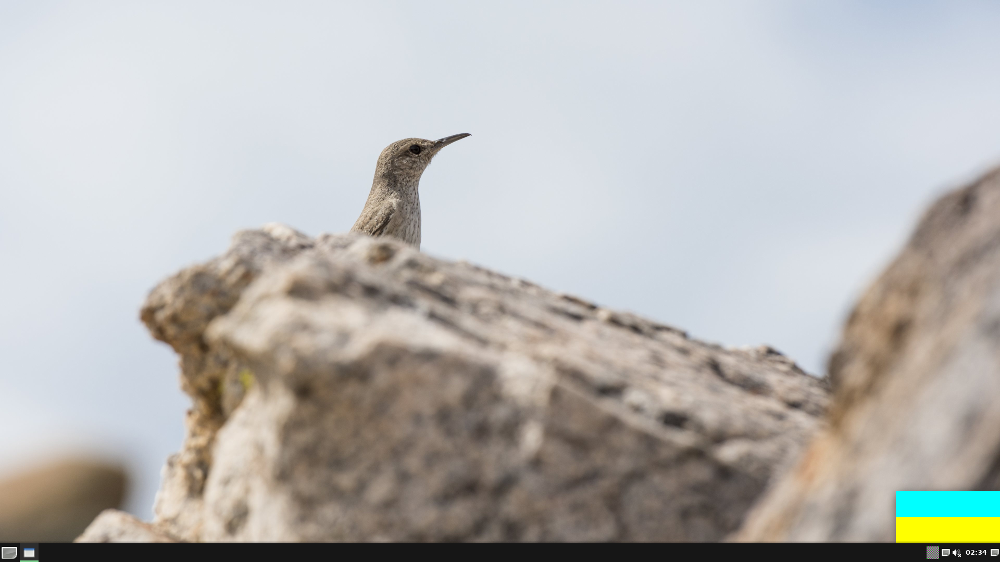
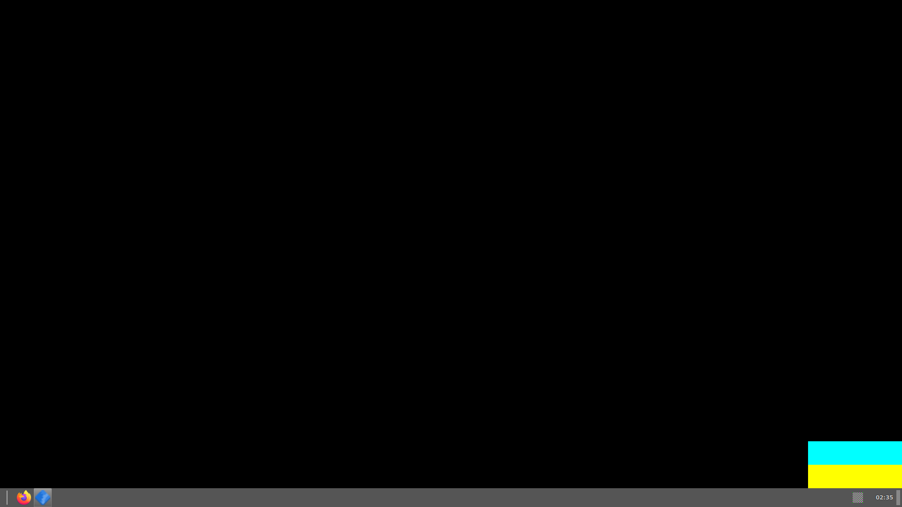
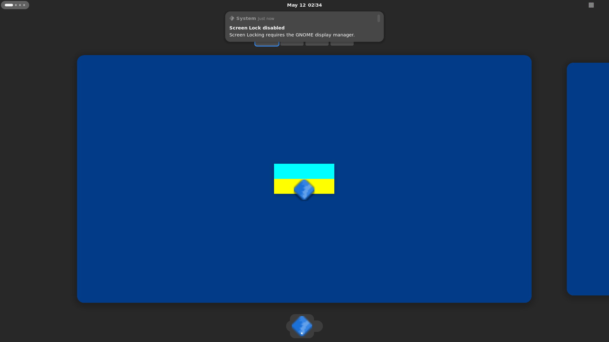
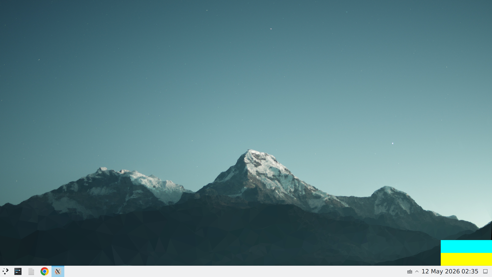
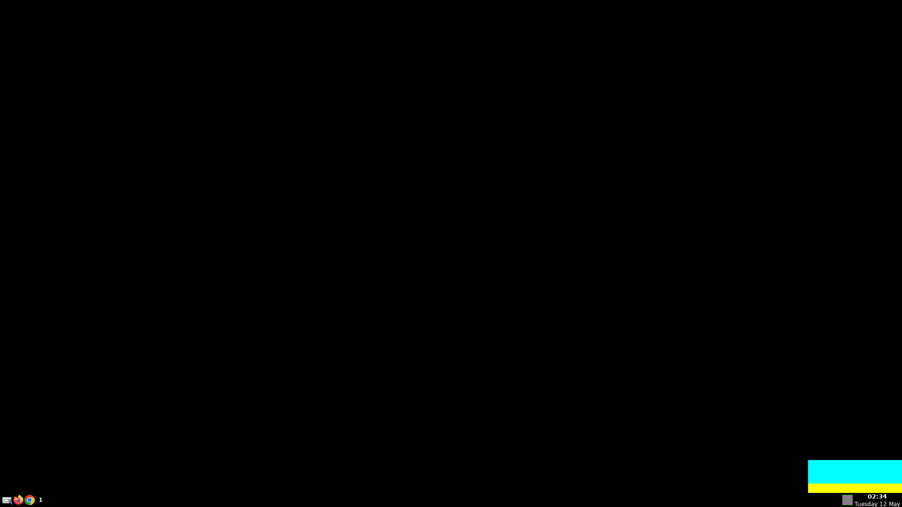
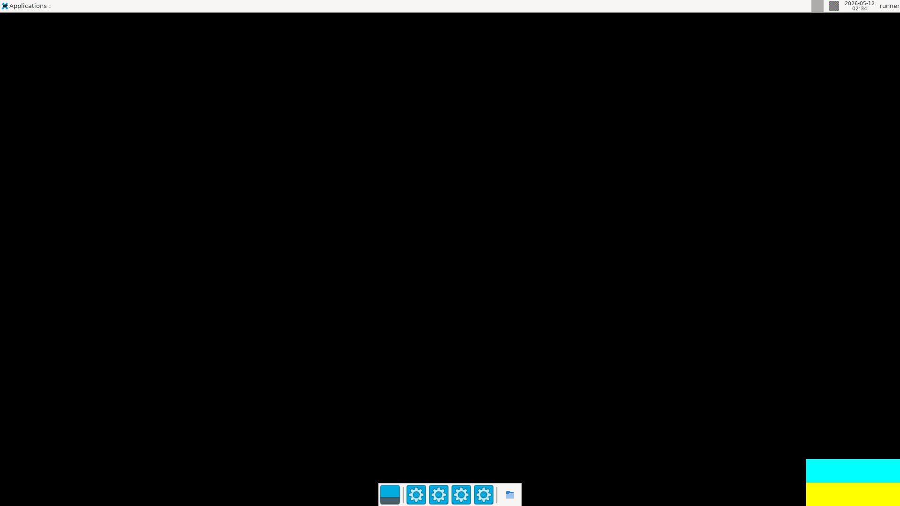
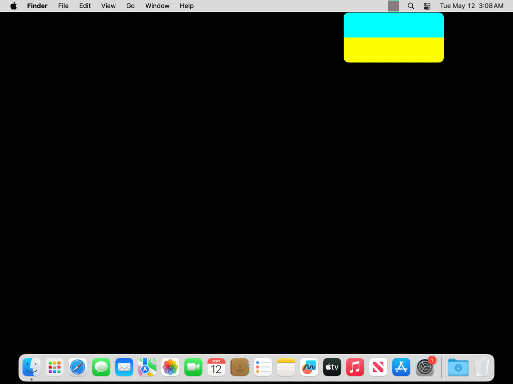
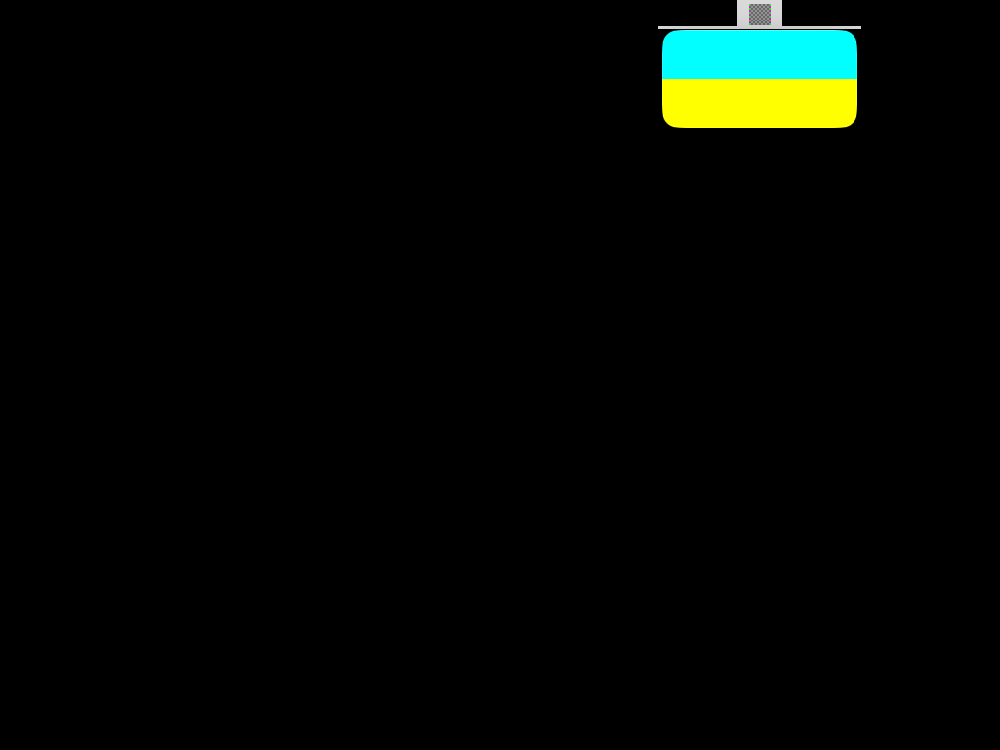
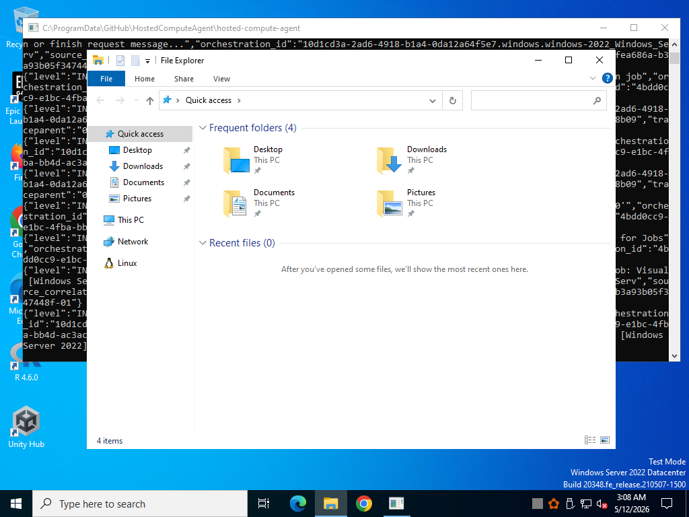
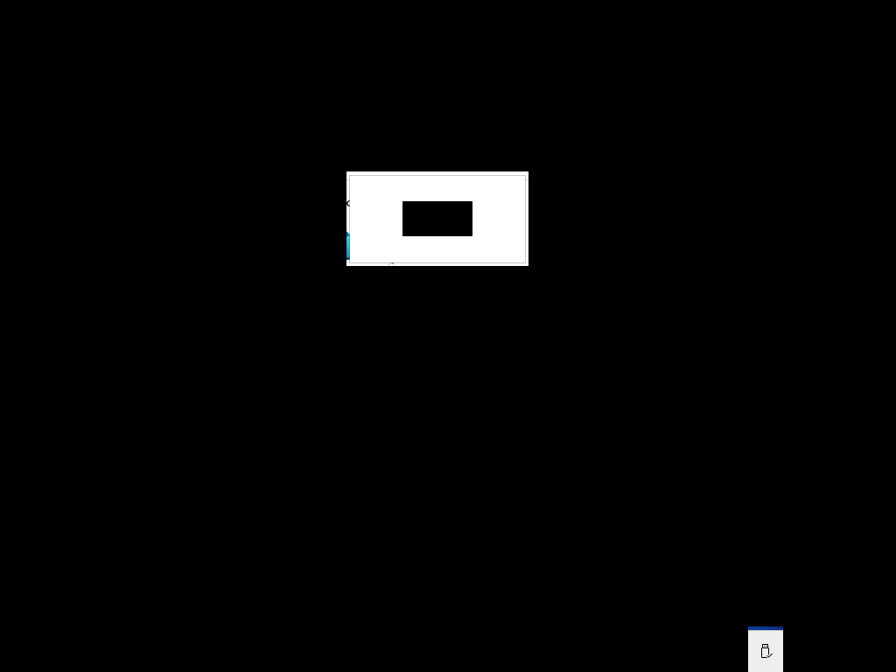

# Platforms where `menubar` is known to work

<!-- platforms:start -->

_Continuously verified by [E2E smoke tests](.github/workflows/e2e.yml)._

| Platform | Status |
| -------- | ------ |
| macOS 14 (Sonoma) | ✅ Pass |
| macOS 15 (Sequoia) | ✅ Pass |
| macOS 26 (Tahoe) | ✅ Pass |
| Ubuntu 22.04 | ✅ Pass |
| Ubuntu 24.04 | ✅ Pass |
| Windows Server 2022 | ✅ Pass |
| Windows Server 2025 | ✅ Pass |

<!-- platforms:end -->

<!-- visual:start -->

_Continuously verified by [visual tray rendering tests](.github/workflows/visual-tray.yml). Each run boots the menubar fixture, screenshots the OS panel, and asserts both the tray icon and the popover window are painted. These checks confirm rendering, not tray-anchored placement. See [Window positioning on Linux](#window-positioning-on-linux)._

| Platform | Tray + Window | Screenshot |
| -------- | ------------- | ---------- |
| Linux (Budgie) | ✅ Pass | 

view

 |
| Linux (Cinnamon) | ✅ Pass | 

view

 |
| Linux (GNOME) | ✅ Pass | 

view

 |
| Linux (KDE Plasma) | ✅ Pass | 

view

 |
| Linux (LXQt) | ✅ Pass | 

view

 |
| Linux (MATE) | ✅ Pass | 

view

 |
| Linux (Sway/Waybar) | ✅ Pass | 

view

 |
| Linux (Tint2) | ✅ Pass | 

view

 |
| Linux (Xfce) | ✅ Pass | 

view

 |
| macOS 14 (Sonoma) | ✅ Pass | 

view

 |
| macOS 15 (Sequoia) | ✅ Pass | 

view

 |
| macOS 26 (Tahoe) | ✅ Pass | 

view

 |
| Windows Server 2022 | ✅ Pass | 

view

 |
| Windows Server 2025 | ✅ Pass | 

view

 |

<!-- visual:end -->

## Window positioning on Linux

The checks above confirm that the tray icon and popover window render. They do **not** assert that the popover is positioned next to the tray icon.

On **native Wayland**, tray-anchored positioning is not possible, and there is nothing the library can do about it. Two protocol limitations stack up: an application cannot set the position of its own window (`setPosition` is a no-op, `getPosition` reads back `[0, 0]`), and the tray icon, hosted by the panel via StatusNotifierItem, reports no coordinates. The compositor decides where the popover appears, which is usually the center of the screen. `menubar` logs a one-time warning when it detects the window could not be positioned.

Under **X11 / XWayland**, an application can position its own window, so the popover is placed where `menubar` computes it. (Some Linux panels still report no tray-icon coordinates over StatusNotifierItem, in which case the window falls back to a screen corner rather than sitting exactly under the icon.)

If a Wayland session places the popover in the wrong spot, running under XWayland with `--ozone-platform=x11` restores positioning.
